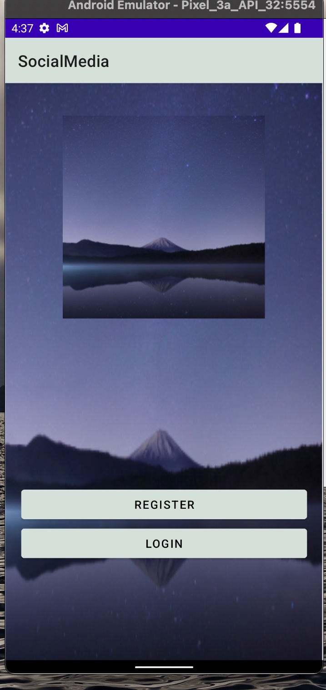
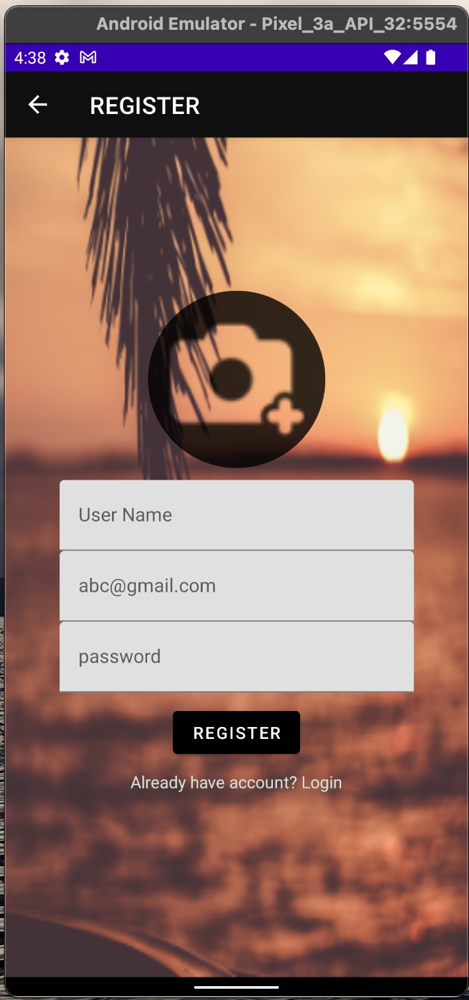
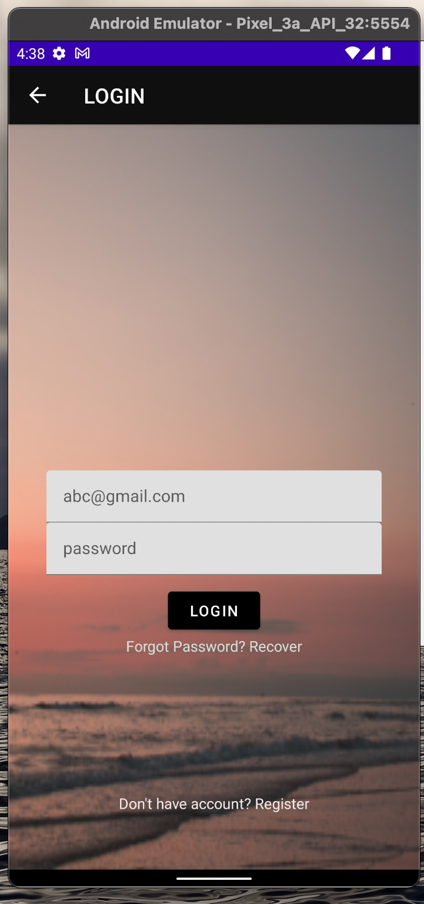
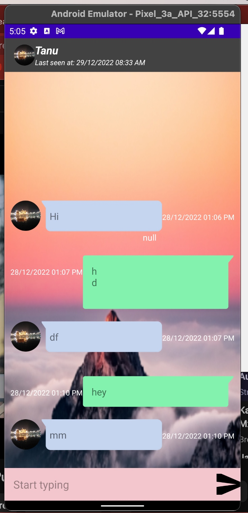
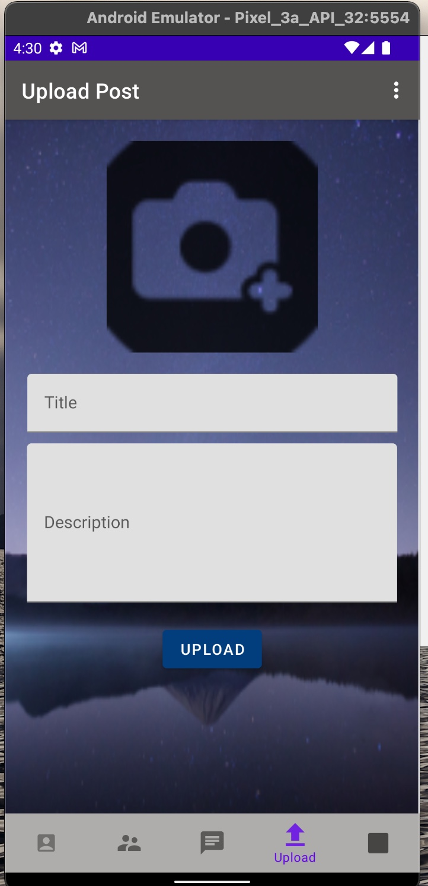
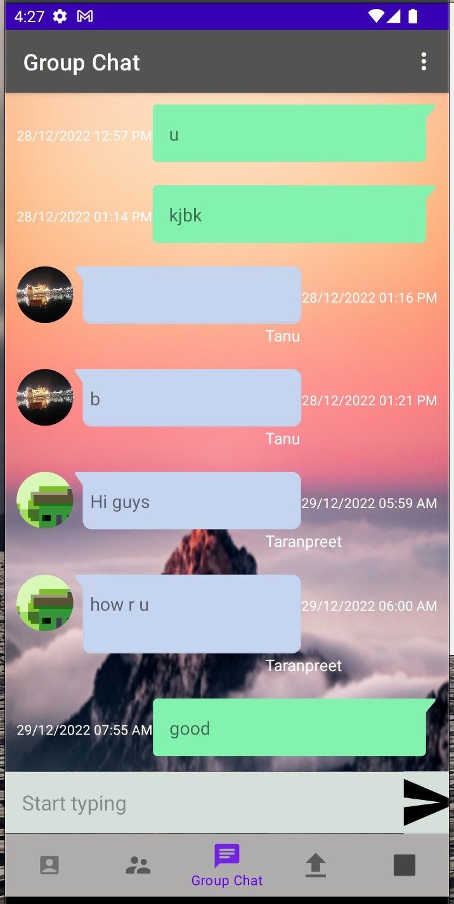
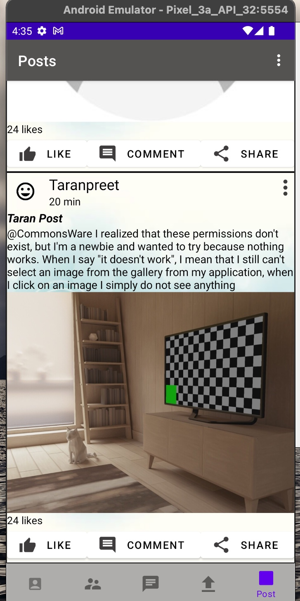

# SocialMedia
•	SocialMedia is Native Mobile app, Using Firebase as a back-end server.                       
•	SocialMedia is using Firebase Authentication, Firebase Realtime Database and Firebase Cloud Storage.                           
• Object-oriented programming (OOP), Data architecture, Database Designing.            
•	Programming language:- Java, Kotlin, XML.  
• SocialMedia have features such as group chat, sending and receiving messages, sharing post, updating profile.

Basically, I have done this project in java but I'm making new files in kotlin.

  
  
    
      
    
  
  
  

 

